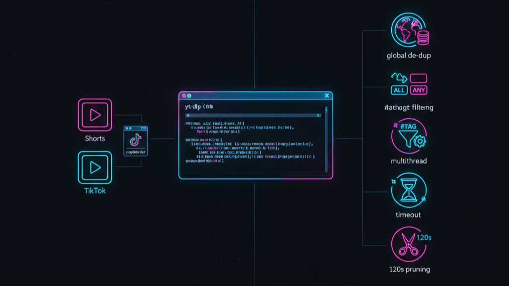

<!-- Banner -->


<h1 align="center">YouTube Shorts & TikTok Downloader Suite</h1>

<p align="center">
  Bulk-download untuk <b>YouTube Shorts</b> & <b>TikTok</b> dengan caption penuh, filter hashtag, de-dup global, dan alat manajemen pustaka.
</p>
<p align="center">
  <a href="images/baner.png" target="_blank">
    
  </a>
</p>
<!-- Core badges -->
<p align="center">
  <!-- Project -->
  <a href="https://github.com/Dhiandika/youtube-shorts-bulk-downloader-CLI/stargazers">
    
  </a>
  <a href="https://github.com/Dhiandika/youtube-shorts-bulk-downloader-CLI/blob/main/LICENSE">
    
  </a>
  
  
</p>

<!-- Tech badges -->
<p align="center">
  <a href="https://github.com/Dhiandika/youtube-shorts-bulk-downloader-CLI/actions/workflows/workflow_name.yml">
    
  </a>
</p>


<!-- Submodule tags -->
<p align="center">
  
  
</p>
<p align="center">


</p>

---

> ⚡️ **Fitur ringkas:** yt-dlp, caption penuh, filter hashtag (all/any), de-dup global (SQLite/TinyDB), numbering stabil, download multithread, pruning durasi, dan tools pengelolaan pustaka.

Bulk-download content from **YouTube Shorts** and **TikTok** with robust tooling: full captions, hashtag filters, global de-duplication, multithread downloads, and library management utilities.

<div align="center">

**Supports:** Windows / macOS / Linux • `yt-dlp` • SQLite / TinyDB
Global de-duplication • Stable numbering • Hashtag rules • Duration pruning

</div>

---
## 📚 Table of Contents

* [YouTube Shorts & TikTok Downloader Suite](#youTube-shorts--tiktok-downloader-suite)

  * [📚 Table of Contents](#-table-of-contents)
  * [Repo Layout](#repo-layout)
  * [Quick Start](#quick-start)
  * [Highlights](#highlights)
  * [Requirements](#requirements)
  * [Installation](#installation)
  * [Usage](#usage)

    * [YouTube Shorts (project in `tiktok/`)](#youtube-shorts-project-in-tiktok)
    * [TikTok Suite (project in `tiktok/`)](#tiktok-suite-project-in-tiktok)
  * [Configuration Notes](#configuration-notes)
  * [Legal](#legal)
  * [License](#license)

---

## Repo Layout

```
📦youtube-shorts-bulk-downloader-CLI
 ┣ 📂images/
 ┃ ┗ 📜image.png
 ┣ 📂tiktok/
 ┃ ┣ 📂tiktok_dl/                # TikTok core package (db, downloader, filters, etc.)
 ┃ ┣ 📂yt_short_downloader/      # YouTube Shorts core package (modular flow)
 ┃ ┣ 📜.env
 ┃ ┣ 📜caption.py
 ┃ ┣ 📜console_guard.py
 ┃ ┣ 📜download_errors.log
 ┃ ┣ 📜main.py                   # YouTube main 1 (classic)
 ┃ ┣ 📜main2.py                  # YouTube main 2 (modular + global de-dup)
 ┃ ┣ 📜main3.py                  # YouTube main 3 (date-window workflow)
 ┃ ┣ 📜prompt.txt
 ┃ ┣ 📜README.md                 # README for the YouTube & TikTok projects inside /tiktok
 ┃ ┣ 📜requirements.txt
 ┃ ┣ 📜sort.py
 ┃ ┗ 📜video_metadata.json
 ┣ 📜.gitattributes
 ┣ 📜.gitignore
 ┣ 📜README.md                   # (this file)
 ┗ 📜yt_simplify.py
```

> Note: The **YouTube** code and the **TikTok** suite both live inside the `tiktok/` folder for historical reasons.

---

## Quick Start

**1) Install Python 3.10+** and system tools:

* `yt-dlp` (Python package)
* `ffmpeg/ffprobe` on PATH (recommended for duration handling)

**2) Install Python deps (from `tiktok/requirements.txt`):**

```bash
pip install -r tiktok/requirements.txt
```

**3) Pick a project:**

* **YouTube Shorts**: go to [tiktok/README.md](tiktok/README.md) for full usage of `main.py`, `main2.py`, `main3.py`.
* **TikTok Suite**: use config-based runners (e.g., `TikTokDownloader.py`, `bulk_from_file.py`) and maintenance tools.

---

## Highlights

### YouTube Shorts

* Download all **Shorts** from a channel
* Interactive or modular mains (`main.py`, `main2.py`, `main3.py`)
* **TinyDB** metadata, **global de-dup** by `video_id`
* **Stable numbering** across runs
* Optional **date windows** (7/30/custom days)
* Utilities: caption generator, sorter, console guard for Windows

### TikTok

* Bulk download from **profiles list** (`users.txt`) or single profile
* **Full caption** (no truncation) written as sidecar `.txt`
* **Hashtag rules** (`all` / `any`) **before** download (skip early)
* **SQLite** DB with statuses (`queued`, `downloading`, `success`, `failed`, `deleted`, `skipped_hashtag`)
* **Multithread downloads**
* Post-download **sorting/filtering** (duration/hashtags) and **pruning** tools
* “Anti-stuck” listing (timeouts) + metadata socket timeouts/retries

---

## Requirements

* **Python** 3.10+
* **yt-dlp** (latest)
* **tqdm**
* **ffmpeg/ffprobe** on PATH (recommended)
* (Optional) Chrome/Firefox/Edge for `cookies-from-browser` when login is required

---

## Installation

```bash
pip install -U yt-dlp tqdm
# or
pip install -r tiktok/requirements.txt
```

**ffmpeg/ffprobe**:

* Windows: download from ffmpeg.org and add `bin/` to PATH
* macOS: `brew install ffmpeg`
* Ubuntu/Debian: `sudo apt-get install ffmpeg`

---

## Usage

### YouTube Shorts (project in `tiktok/`)

See **[tiktok/README.md](tiktok/README.md)** for complete instructions.

* `python tiktok/main.py` – Classic single-file flow
* `python tiktok/main2.py` – Modular + TinyDB + global de-dup
* `python tiktok/main3.py` – Date-window workflow (7/30/custom days)

Utilities: `console_guard.py`, `caption.py`, `sort.py`

---

### TikTok Suite (project in `tiktok/`)

**Prepare `users.txt` (one profile/URL per line):**

```
# comments allowed
@some_user
https://www.tiktok.com/@another_user
```

**Recommended runners (edit constants at the top, no CLI args):**

* `TikTokDownloader.py` — one-shot, reads `users.txt`, prefilters by hashtag, anti-dup via SQLite, downloads multithreaded.
* `bulk_from_file.py` — “anti-stuck”: listing via `yt-dlp -J --flat-playlist` (timeout), metadata socket timeouts/retries, prefilter hashtags, then download.

**Maintenance / library management:**

* `manage_videos.py` (CLI) or your config-based variant

  * **Sort** by duration
  * **Filter** by duration/hashtags; optionally delete files + sidecar captions; DB status → `deleted`
* `prune_by_duration.py` (if you added it) — prune a folder by duration and delete paired `.txt` sidecars

---

## Configuration Notes

* **YouTube** defaults are in `tiktok/yt_short_downloader/config.py`.
* **TikTok** defaults are in `tiktok/tiktok_dl/config.py` (e.g., `THREADS`, `MAX_RETRIES`, `DEFAULT_DB`, `DEFAULT_OUTDIR`).
* When profiles need login/age-gate, enable cookies from your browser.

---

## Legal

Download only content you have rights/permission to save. Respect platform ToS and copyright laws. Cookies are personal—do not share credentials.

---

## License

MIT (or your preferred license). Add a `LICENSE` file if needed.

---

# `tiktok/README.md` (YouTube-folder specific)

# Download all YouTube Shorts from a channel

Bulk download Shorts from a YouTube channel using Python ≥ 3.10.

<div align="center">

**Supports:** Windows / macOS / Linux • `yt-dlp` • TinyDB
Global de-duplication by `video_id` • Persistent numbering • Date window (7/30/custom days)

</div>

---

## 📚 Table of Contents

- [`tiktok/README.md` (YouTube-folder specific)](#tiktokreadmemd-youtube-folder-specific)
- [Download all YouTube Shorts from a channel](#download-all-youtube-shorts-from-a-channel)
  - [📚 Table of Contents](#-table-of-contents-1)
  - [About the Project](#about-the-project)
  - [Project Layout](#project-layout)
  - [Quick Start](#quick-start-1)
  - [Which “main” should I use?](#which-main-should-i-use)
    - [Main 1 — Classic single-file flow](#main-1--classic-single-file-flow)
    - [Main 2 — Modular + DB + Global de-dup](#main-2--modular--db--global-de-dup)
    - [Main 3 — Date-window workflow (daily/weekly)](#main-3--date-window-workflow-dailyweekly)
  - [Core Features](#core-features)
  - [Requirements](#requirements-1)
  - [Configuration](#configuration)
  - [Output \& Numbering](#output--numbering)
  - [De-duplication Rules](#de-duplication-rules)
  - [Utility Scripts](#utility-scripts)
    - [`caption.py` (optional)](#captionpy-optional)
    - [`sort.py` (optional)](#sortpy-optional)
  - [Contributing](#contributing)
  - [License](#license-1)
    - [Notes for Maintainers](#notes-for-maintainers)

---

## About the Project

This directory contains a command-line toolset to download **YouTube Shorts** from a channel, safely, quickly, and repeatably:

* Interactive CLI with quality selection
* Safe filenames (ASCII-only) to avoid Windows console issues
* **TinyDB** for persistent metadata & download history
* **Global de-dup** across channels (by `video_id`)
* **Stable numbering** across runs (doesn’t reset at 1)
* Optional **date filters** (7 / 30 / custom days)

---

## Project Layout

```
tiktok/
├─ main.py                      # Main 1: classic single-file flow
├─ main2.py                     # Main 2: modular + DB + global de-dup
├─ main3.py                     # Main 3: date-window workflow (+debug/enrichment)
├─ yt_short_downloader/
│  ├─ __init__.py
│  ├─ config.py                 # Defaults (output dir, retries, etc.)
│  ├─ fetch.py                  # get_short_links() via yt-dlp (extract_flat)
│  ├─ downloader.py             # download_video(s), safe filenames, retries
│  ├─ orchestrator.py           # index reservation, callbacks, DB marking
│  ├─ utils.py                  # filename sanitizers, numbering helpers
│  ├─ ytdlp_tools.py            # check_yt_dlp_installation, format helpers
│  ├─ db.py                     # TinyDB store (channels/videos), dedupe helpers
├─ console_guard.py             # Windows-safe printing & UTF-8 env patch
├─ caption.py                   # (optional) caption generation utility
├─ sort.py                      # (optional) organizer/renamer utility
├─ requirements.txt
└─ README.md                    # (this file)
```

---

## Quick Start

1. **Install Python** 3.10+
2. **Install system tools** — `yt-dlp` (Python package)
3. **Install Python deps**

```bash
pip install -r requirements.txt
```

4. **Run one of the mains** (see next section):

```bash
python main.py                # Classic flow
python main2.py               # Modular + DB + global de-dup
python main3.py               # Date-window workflow
```

> 💡 Windows users: use `console_guard.py` to set `PYTHONIOENCODING=UTF-8` and patch `print` to avoid `charmap` issues.

---

## Which “main” should I use?

### Main 1 — Classic single-file flow

**File:** `main.py`
**Use when:** You want the original step-by-step flow (no date filtering).

**Flow:**

1. Ask for channel URL
2. Fetch & preview list (first 10 titles)
3. Confirm to proceed
4. Choose how many videos to download (or all)
5. Choose quality (best/worst/137+140/136+140/135+140)
6. Choose file format (MP4/WEBM)
7. Show final list to download
8. Download with progress bar

**What’s included:**

* Safe ASCII printing (via `console_guard`)
* Caption `.txt` next to each video
* Retries + best-format fallback
* **DB de-dup per `video_id` globally** (skips across channels)
* Persistent numbering in the output folder

Run:

```bash
python main.py
```

---

### Main 2 — Modular + DB + Global de-dup

**File:** `main2.py`
**Use when:** You want the **modular code** path with TinyDB, orchestrator (stable numbering), and **global de-dup** across channels.

**Flow:** Similar to Main 1, but uses the refactored modules and DB flow everywhere.

**Extra goodies:**

* `TinyStore.is_downloaded_any(video_id)` → skip across channels
* `orchestrator.reserve_indices()` → numbering continues across runs
* Cleaner logs / error handling

Run:

```bash
python main2.py
```

---

### Main 3 — Date-window workflow (daily/weekly)

**File:** `main3.py`
**Use when:** You want to download **only videos in the last 7 days / 30 days / custom X days**.

**Flow:**

1. Ask for channel URL
2. Choose time window: 7 / 30 / custom / all
3. Fetch & **debug-dump** entries (raw/normalized/parsed dates)
4. Filter by date window
5. (Optional) **Enrich** missing `upload_date` via per-video `yt-dlp --dump-single-json` (max 25)
6. DB upsert, **global de-dup**, preview, download

Run:

```bash
python main3.py
```

---

## Core Features

* ✅ Bulk-download Shorts from a channel
* ✅ Quality selection & format (mp4/webm)
* ✅ Safe filenames (ASCII-only) to avoid Windows encoding issues
* ✅ Multithread downloads with retries + backoff
* ✅ Caption `.txt` generation per video
* ✅ Progress bar via `tqdm`
* ✅ **TinyDB** metadata: channels/videos, timestamps
* ✅ **Global de-dup** by `video_id` (skip across channels and future runs)
* ✅ **Date filters** (Main 3): 7 / 30 / custom X days, with optional quick enrichment

---

## Requirements

* **Python** 3.10+
* **yt-dlp** (Python package)
* Python libs (see `requirements.txt`), e.g., `tqdm`, `tinydb`, etc.

---

## Configuration

See `yt_short_downloader/config.py`. Common defaults:

* `DEFAULT_OUTPUT_DIR` → e.g., `"new_week"`
* `DEFAULT_FILE_FORMAT` → `"mp4"`
* `MAX_RETRIES` → `3`

You can change these or pass custom values inside your wrapper scripts.

---

## Output & Numbering

* Files are named like:
  `NN - Clean_Title - Channel_Name.mp4`
  where `NN` continues from the **highest existing index** in the output directory.
* Numbering is **reserved in DB** before starting (via `orchestrator`) to guarantee consistency even with multithreading.

---

## De-duplication Rules

* **Primary key**: YouTube `video_id` (unique globally).
* **Global check**: `TinyStore.is_downloaded_any(video_id)` ensures a video won’t be downloaded again even if you switch channels later.
* On successful download, `orchestrator` marks `downloaded=True` in DB; future runs will skip that `video_id`.

> If you ever want per-channel duplicates (not recommended), you could switch back to `store.is_downloaded(channel_key, vid)` — but the repo defaults to **global** de-dup to avoid clutter.

---

## Utility Scripts

### `caption.py` (optional)

* Reads `.txt` prompt files and generates social captions via a model (you provide the API key).
* Overwrites the original `.txt` with the generated caption + hashtags.

See the script header for usage details.

### `sort.py` (optional)

* Sort videos by mtime and rename to `NN - CleanName.ext`.
* Renames matching `.txt` sidecars to keep captions aligned.
* `--desc` for newest → oldest.

---

## Contributing

PRs welcome! If you’re adding features:

* Keep the modular code in `yt_short_downloader/` clean & typed.
* Prefer adding new flows as separate mains (so users can choose).
* Include a short note in this README.

---

## License

MIT (or your preferred license). Add a `LICENSE` file if you haven’t yet.

---

### Notes for Maintainers

* The **DB schema** is intentionally simple (TinyDB tables: `channels`, `videos`).
* Global de-dup relies on `videos` documents where `downloaded=True`.
* If you change the DB path or table names, please reflect it in this README.
